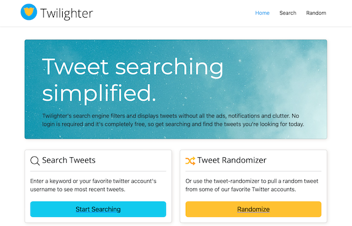

# Twilighter

 

_A full-stack web app that collects tweet data from Twitter's API on the server and hosts a local API for the client to call to retrieve that data._

 

See it in action [here]().

 

Screenshot: 

## Details

### Server:

-  Python-based server using Flask framework
-  Accesses Twitter API v2
-  Collect and filter tweet data
-  Creates API endpoints for the client to call

### Client:

-  Made with Javascript, ReactJS and Bootstrap components
-  Features three main pages (Home, Search, and Random) and a "Not Found" page for 404 errors
-  **Search** allows tweet or keyword searching and sends a request with the query to the server API endpoints which returns that data to present as tweets
-  The **Random** button generates a random tweet based on criteria set by the server

## Skills Developed

-  Quickly learned Python from scratch to build the server
-  Making API requests to the Twitter API using authentication, headers, and queries
-  Communicating between server and client via API endpoints
-  Using React-Router library to implement pages for the front-end
-  Bootstrap continues to save me a lot of time with all the different components available
-  Error handling in Python and Javascript
-  The larger the project got the more it forced me to get organized for my own sanity

## Author

-  **Nick Schaefer** - _Full-Stack Software Developer_ - [Website](https://www.nschaefer.com/) | [LinkedIn](https://www.linkedin.com/in/nick-n-schaefer)
